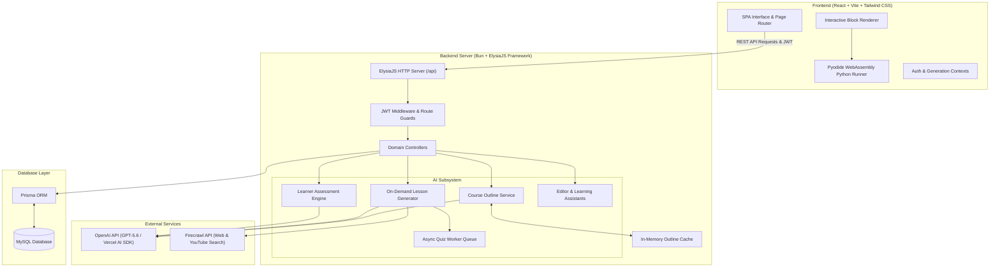
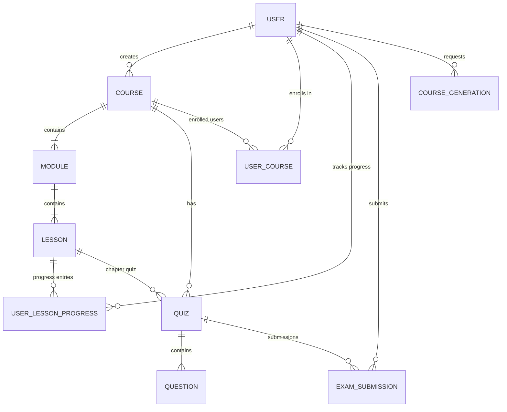
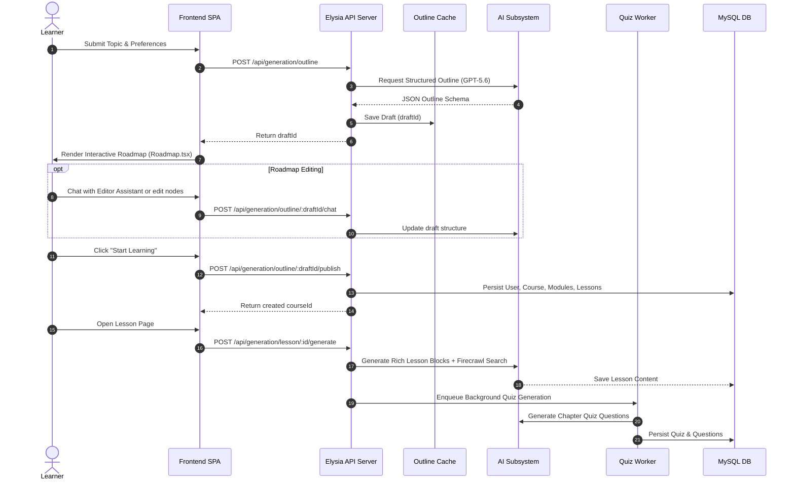
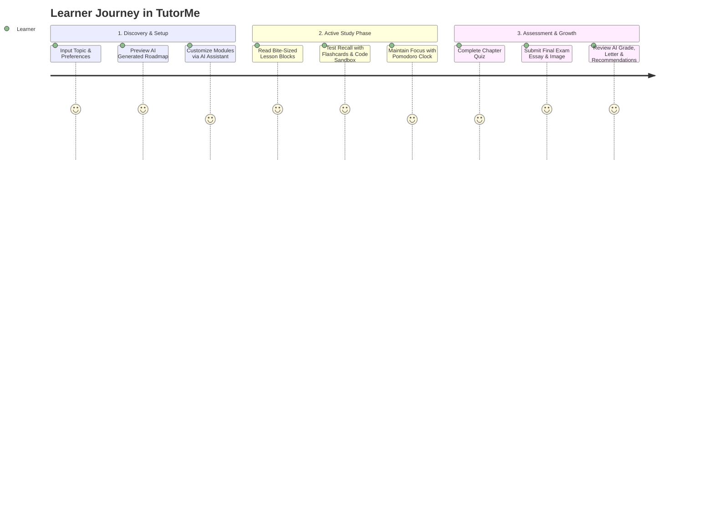

# TutorMe 🎓🤖 — Comprehensive Architecture & Product Overview

> **AI-Powered Personal Active Learning Tutor Platform**  
> *Transforming passive online learning into bite-sized active practice through structured AI roadmaps, dynamic content blocks, empathetic grading, and real-time feedback.*

---

## 📌 Executive Summary

**TutorMe** is a fullstack web application designed to solve the primary challenges faced by self-taught learners: **information overload**, **lack of learning structure**, and **passive consumption** (e.g., watching videos without active engagement). 

By integrating OpenAI's GPT-5.6 model via the Vercel AI SDK, Bun runtime, ElysiaJS, and Prisma ORM with MySQL, TutorMe turns arbitrary learning topics into structured, multi-module active learning journeys. Every lesson presents interactive blocks (flashcards, code sandboxes, interactive reveals, quizzes, and analogies), embedded Pomodoro timers, on-demand AI quiz generation, empathetic essay grading (with optional handwriting/diagram image analysis), and comprehensive growth analytics.

---

## 🏛️ 1. Software Architect Perspective

### 1.1 High-Level System Architecture

TutorMe is built using a decoupled client-server architecture with asynchronous background task processing for AI workloads.



### 1.2 Architectural Patterns & Design Decisions

1. **4-Layer Backend Architecture:**
   - **Layer 1: Routes & Schemas:** Located in [`backend/src/models/`](file:///d:/tutorme/backend/src/models), route definitions use TypeBox (`t.Object`) schemas for strict type validation at runtime.
   - **Layer 2: Middleware & Authentication:** Authentication is handled by [`backend/src/middleware/auth.ts`](file:///d:/tutorme/backend/src/middleware/auth.ts) using `@elysiajs/jwt`. Scoped route guards ([`protectedAssessmentRoute`](file:///d:/tutorme/backend/src/models/generation/generation-assessment.route.ts#L43-L148)) derive user identity strictly from verified tokens to prevent identity spoofing.
   - **Layer 3: Domain Services:** Modular services under [`backend/src/services/ai/domain/`](file:///d:/tutorme/backend/src/services/ai/domain) encapsulate complex AI prompt engineering, response parsing/normalization, outline persistence, and assessment scoring.
   - **Layer 4: Data Access Layer:** Managed via Prisma ORM [`backend/prisma/schema.prisma`](file:///d:/tutorme/backend/prisma/schema.prisma) targeting MySQL.

2. **Asynchronous On-Demand Generation Pipeline:**
   - **Staged Outline Creation:** Course creation generates an in-memory draft stored in [`OutlineCacheService`](file:///d:/tutorme/backend/src/services/ai/domain/outline-cache.service.ts). This avoids premature DB pollution before the user customizes or confirms the roadmap.
   - **Lazy Lesson & Quiz Generation:** Lessons and quizzes are generated *on demand* when accessed by the learner. [`QuizWorkerService`](file:///d:/tutorme/backend/src/services/ai/workers/quiz-worker.service.ts) enqueues quiz generation tasks asynchronously, ensuring fast initial page loads.

3. **Concurrency & Race Condition Defenses:**
   - Database operations incorporate strict unique constraints (`canonicalAttemptKey`, `chapterQuizLessonKey`, `[userId, courseId]`, `[userId, lessonId]`).
   - Verified through contract tests ([`learner-assessment-idempotency.contract.test.ts`](file:///d:/tutorme/backend/src/services/ai/domain/learner-assessment-idempotency.contract.test.ts) and [`user-lesson-completion-race.contract.test.ts`](file:///d:/tutorme/backend/src/services/ai/domain/user-lesson-completion-race.contract.test.ts)).

### 1.3 Database Entity-Relationship Diagram



### 1.4 Scalability & Bottleneck Analysis

| Component | Potential Bottleneck | Mitigation Strategy |
| :--- | :--- | :--- |
| **AI Generation Engine** | OpenAI API latency & rate limits during outline/lesson generation. | In-memory outline caching, background worker queue for quizzes (`QuizWorkerService`), and stream-friendly JSON normalization. |
| **In-Memory Cache** | `outlineCache` uses process memory (`Map`). Server restarts purge unpublished drafts. | Move draft cache to Redis for multi-instance horizontal scaling and resilience across restarts. |
| **Code Execution** | Server-side execution of user code poses high security and CPU overhead risks. | Client-side WebAssembly execution via Pyodide ([`pythonInterpreter.ts`](file:///d:/tutorme/frontend/src/components/blocks/pythonInterpreter.ts)), completely offloading compute to the browser. |
| **Database Connections** | High connection overhead under concurrent request spikes. | Connection pooling via Prisma and MySQL connection limits managed in `docker-compose.yml`. |

---

## 💻 2. Software Developer Perspective

### 2.1 Code Base Structure

```
tutorme/
├── backend/
│   ├── prisma/
│   │   └── schema.prisma                # Relational MySQL Schema
│   ├── src/
│   │   ├── index.ts                     # Main ElysiaJS Server Entrypoint
│   │   ├── lib/
│   │   │   └── prisma.ts                # Prisma Client Instance
│   │   ├── middleware/
│   │   │   └── auth.ts                  # JWT Verification Middleware
│   │   ├── models/                      # Elysia Routes & Controllers
│   │   │   ├── auth/                    # Auth login, signup, session routes
│   │   │   ├── course/                  # Course CRUD & library routes
│   │   │   ├── generation/              # AI outline, lesson, exam & assessment routes
│   │   │   └── ... (user, module, lesson, quiz, exam-submission)
│   │   └── services/
│   │       └── ai/                      # AI Subsystem Core & Domain Services
│   │           ├── assistants/          # Editor & Learning Chat Assistant Services
│   │           ├── core/                # AI model configuration & Firecrawl search tools
│   │           ├── domain/              # Course, Lesson, Quiz & Assessment Generators
│   │           └── workers/             # Async background quiz worker
├── frontend/
│   ├── src/
│   │   ├── auth/                        # Auth Context & JWT Session Storage
│   │   ├── components/                  # UI Components & Custom Modals
│   │   │   ├── blocks/                  # Interactive Lesson Content Block Renderers
│   │   │   ├── AssessmentReview.tsx     # Quiz / Final Exam detailed review component
│   │   │   ├── CourseSidebar.tsx        # Module navigation & completion sidebar
│   │   │   └── PomodoroTimer.tsx        # Embedded study timer component
│   │   ├── context/                     # Global state (Course Generation Context)
│   │   ├── pages/                       # Application Views
│   │   │   ├── Landing.tsx              # Marketing & feature introduction page
│   │   │   ├── Home.tsx                 # User dashboard & course creation trigger
│   │   │   ├── Roadmap.tsx              # Interactive AI outline roadmap previewer
│   │   │   ├── Course.tsx               # Course view & lesson selector
│   │   │   ├── Lesson.tsx               # Lesson viewer & Pomodoro integration
│   │   │   ├── Quiz.tsx                 # Chapter quiz interface
│   │   │   ├── FinalExam.tsx            # Comprehensive final assessment
│   │   │   ├── CourseAnalysis.tsx       # AI grade evaluation & growth analytics
│   │   │   └── Library.tsx              # Course collection & discovery
│   │   └── constant/
│   │       └── router.tsx               # React Router configuration
```

### 2.2 Core Technical Subsystems

#### A. Interactive Block Rendering System
Lesson content is structured as typed JSON blocks generated by AI ([`backend/src/services/ai/domain/lesson-blocks.ts`](file:///d:/tutorme/backend/src/services/ai/domain/lesson-blocks.ts)). The frontend parses and renders these blocks dynamically in [`BlockRenderer.tsx`](file:///d:/tutorme/frontend/src/components/BlockRenderer.tsx):

- **Learning Objectives:** [`LearningObjectiveCard.tsx`](file:///d:/tutorme/frontend/src/components/blocks/LearningObjectiveCard.tsx)
- **Analogies:** [`AnalogyCard.tsx`](file:///d:/tutorme/frontend/src/components/blocks/AnalogyCard.tsx)
- **Examples & Warnings:** [`ExampleCard.tsx`](file:///d:/tutorme/frontend/src/components/blocks/ExampleCard.tsx), [`WarningCard.tsx`](file:///d:/tutorme/frontend/src/components/blocks/WarningCard.tsx)
- **Active Recall Flashcards:** [`FlashcardComponent.tsx`](file:///d:/tutorme/frontend/src/components/blocks/FlashcardComponent.tsx) (Flip animations for quick self-testing)
- **Click-to-Reveal Hints:** [`InteractiveRevealComponent.tsx`](file:///d:/tutorme/frontend/src/components/blocks/InteractiveRevealComponent.tsx)
- **Embedded Python Sandbox:** [`CodeSandboxComponent.tsx`](file:///d:/tutorme/frontend/src/components/blocks/CodeSandboxComponent.tsx) (In-browser code execution using WebAssembly/Pyodide)
- **Markdown & Math Rendering:** [`MarkdownRenderer.tsx`](file:///d:/tutorme/frontend/src/components/blocks/MarkdownRenderer.tsx) (LaTeX formatting powered by KaTeX)

#### B. Asynchronous Course Generation Workflow



### 2.3 Maintainability & Code Quality Highlights

- **Contract Tests:** Extensive test suite in backend ([`lesson-blocks.contract.test.ts`](file:///d:/tutorme/backend/src/services/ai/domain/lesson-blocks.contract.test.ts), [`lesson-quiz-review.contract.test.ts`](file:///d:/tutorme/backend/src/services/ai/domain/lesson-quiz-review.contract.test.ts), [`quiz-lesson-link.contract.test.ts`](file:///d:/tutorme/backend/src/services/ai/domain/quiz-lesson-link.contract.test.ts)) guarantees AI JSON outputs strictly adhere to application contracts.
- **Robust Model Normalization:** AI outputs are passed through strict schema parsers ([`normalizeModelResponse()`](file:///d:/tutorme/backend/src/services/ai/core/ai.service.ts)) to catch truncated JSON or non-standard key names before saving to the database.

---

## 🎯 3. Product Manager Perspective

### 3.1 Targeted User Persona & Core Pain Points

> **Primary Persona: Andi Pratama (21, Self-Taught Learner / College Student)**
> - **Frustration:** Wants to learn new technical skills (e.g., Machine Learning, Web3, Data Science), but gets overwhelmed by unstructured video playlists and long articles. Watching videos leads to passive head-nodding without retention.
> - **Need:** Clear step-by-step guidance, bite-sized lessons, interactive practice, immediate feedback, and motivation retention.



### 3.2 Key Product Features & Value Propositions

1. **Personalized AI Roadmap Generator:**
   - Users input any topic (e.g., *"Quantum Computing for Beginners"*) along with difficulty level, language preference, quiz lengths, and optional essay/image requirements.
   - Generates an editable, visual node graph roadmap before commitment.

2. **Active Learning Content Blocks:**
   - Replaces walls of text with interactive cards: analogies, key takeaways, active recall flashcards, click-to-reveal prompts, and executable code sandboxes.

3. **Integrated Pomodoro Study Clock:**
   - Embedded timer inside lessons ([`PomodoroTimer.tsx`](file:///d:/tutorme/frontend/src/components/PomodoroTimer.tsx)) maintains focus and prevents burnout.

4. **Empathetic AI Assessment & Grading:**
   - Evaluates multiple-choice and open-ended essay questions.
   - Supports image uploads (handwritten work/diagrams) for vision-capable AI evaluation.
   - Provides letter grades (A, B, C, Needs Review), score percentages, time metrics, and detailed actionable growth advice ([`CourseAnalysis.tsx`](file:///d:/tutorme/frontend/src/pages/CourseAnalysis.tsx)).

5. **Doodle Notebook UI & Gamification:**
   - Comforting, pastel graph-paper notebook aesthetic with custom SVG mascot ([`RobotLogo.tsx`](file:///d:/tutorme/frontend/src/components/RobotLogo.tsx)), washi tape accents, streak tracking (`streakCount`), and dynamic color schemes (`blue`, `yellow`, `green`, `pink`, `purple`).

---

## 🚀 4. Actionable Insights & Recommendations

### 4.1 Architecture & Technical Debt Recommendations

1. **Migrate In-Memory Draft Cache to Redis:**
   - *Issue:* `outlineCache` currently relies on Node/Bun in-memory storage. Multi-node server deployments or container restarts will purge active drafts.
   - *Action:* Replace `outlineCache` with a Redis backend with TTL expiration.

2. **Decouple Router & Component Imports:**
   - *Issue:* Graphify analysis detected circular dependency chains involving `router.tsx`, `CourseGenerationContext.tsx`, and modal/page components.
   - *Action:* Refactor modal triggers into lightweight context hooks to break circular import cycles.

3. **Persistent Background Queue:**
   - *Issue:* `QuizWorkerService` processes jobs in an in-memory queue.
   - *Action:* Implement BullMQ or Redis-backed task queue for background AI generations to ensure job durability across service restarts.

### 4.2 Feature & Product Enhancement Opportunities

1. **Spaced Repetition Flashcard System (SRS):**
   - Implement an automated daily flashcard deck pulling from previously completed lessons to boost long-term retention.

2. **Adaptive Learning Difficulty:**
   - Dynamically adjust subsequent quiz and lesson difficulty based on the learner's past exam grades and completion speed.

3. **Community Course Marketplace & Sharing:**
   - Leverage existing database fields (`isPublic`, `downloadsCount`, `likesCount` on `Course`) to allow users to publish and discover community-created roadmaps.

---

## 🛠️ 5. Development & Deployment Reference

- **Local Setup:** Refer to [`README.md`](file:///d:/tutorme/README.md) for environment configuration and database seeding.
- **Deployment Guide:** Refer to [`DEPLOYMENT.md`](file:///d:/tutorme/DEPLOYMENT.md) for production container builds and environment variable references.
