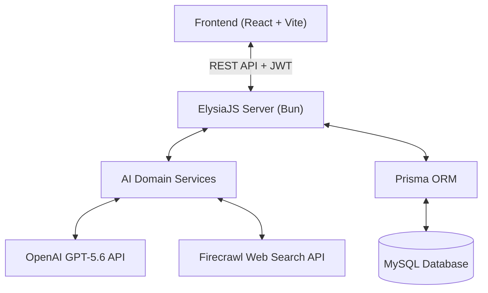

# TutorMe 🎓🤖

> **AI-Powered Personal Active Learning Tutor**  
> *Stop passive learning, start active practice.*


[]()
[](LICENSE)
[](https://openai.com/)
[](https://openai.devpost.com/)

---

## 📖 Deep-Dive Documentation

> [!NOTE]
> For an in-depth architectural breakdown, code structure guide, product management strategy, and Mermaid flow diagrams, read [OVERVIEW.md](OVERVIEW.md).

---

## 📌 About TutorMe

**TutorMe** is a fullstack AI-powered personal tutor platform that turns passive content consumption into active, bite-sized practice. It features automated AI course roadmaps, interactive lesson content blocks (flashcards, code sandboxes, interactive reveals), an embedded Pomodoro timer, real-time AI essay evaluation, and an aesthetic pastel graph-paper notebook UI.

Built with **React**, **ElysiaJS**, **Bun**, **Prisma ORM**, and **OpenAI GPT-5.6**, accelerated by **OpenAI Codex**.

---

## 🏛️ System Overview & Perspectives Summary

For complete details, see [`OVERVIEW.md`](OVERVIEW.md). Below is a summary of the analysis across three core perspectives:

### 1. Software Architect Perspective
- **4-Layer Architecture:** Decoupled routes, authenticated controllers, domain AI services, and Prisma ORM layer.
- **Asynchronous AI Pipeline:** Staged outline generation cached in-memory (`outlineCache`), lazy lesson block generation, and background async quiz generation via `QuizWorkerService`.
- **Database Schema:** 10 core domain models (`User`, `Course`, `Module`, `Lesson`, `UserCourse`, `UserLessonProgress`, `CourseGeneration`, `Quiz`, `Question`, `ExamSubmission`).



### 2. Software Developer Perspective
- **Interactive Block Renderer System:** Renders rich content blocks ([`BlockRenderer.tsx`](file:///d:/tutorme/frontend/src/components/BlockRenderer.tsx)) including flashcards, interactive reveals, KaTeX math expressions, and an in-browser Python WebAssembly sandbox ([`pythonInterpreter.ts`](file:///d:/tutorme/frontend/src/components/blocks/pythonInterpreter.ts)).
- **Safety & Verification:** AI response normalization ([`ai.service.ts`](file:///d:/tutorme/backend/src/services/ai/core/ai.service.ts)) and extensive contract tests ensure schema validity.

### 3. Product Manager Perspective
- **Target Persona:** Self-taught learners overwhelmed by unstructured content (e.g., Andi Pratama, college student).
- **Core Value Proposition:** Converts passive reading/video watching into bite-sized practice with active recall, empathetic AI letter grading, and visual graph-paper doodle branding.

---

## 🚀 Key Features

- 🗺️ **AI Curriculum & Roadmap Generator:** Input any learning topic; GPT-5.6 generates a structured step-by-step roadmap.
- ⏱️ **Integrated Pomodoro Study Timer:** Embedded study clock inside lessons to maintain focus and prevent burnout.
- 📝 **Active Lesson Quizzes:** Automated per-lesson quizzes with multiple-choice questions and open-ended essay prompts.
- 🤖 **Real-Time AI Essay Evaluation:** GPT-5.6 evaluates essay answers and optional handwritten/diagram image uploads with detailed feedback.
- 📊 **Progress & Analytics Dashboard:** Visual progress tracking, grade letters (A-F), and saved course management in a personal library.
- 🎨 **Pastel Graph-Paper Notebook UI:** Comforting doodle aesthetic with washi-tape accents and custom SVG mascot components.

---

## 🤖 Built with OpenAI Codex & GPT-5.6

**TutorMe** was built during the **OpenAI Build Week Hackathon**, leveraging **OpenAI Codex** as our primary autonomous AI coding partner.

### Highlights of Codex Integration:
1. **Prisma Database Architecture:** Codex engineered our relational schema (`schema.prisma`), handling `User`, `Course`, `LessonProgress`, `ExamSubmission`, and canonical uniqueness constraints.
2. **ElysiaJS Backend Scaffolding:** Codex built our 4-layer backend architecture (`schema`, `service`, `controller`, `route`) across 10 domain models.
3. **Frontend Integration:** Codex accelerated React state management, Vercel AI SDK streaming endpoints, and custom SVG doodle components.

---

## 🛠️ Tech Stack

- **Frontend:** React, TypeScript, Tailwind CSS, Lucide Icons, Vite, KaTeX, Pyodide (WASM)
- **Backend:** ElysiaJS, Node.js / Bun, TypeScript
- **Database & ORM:** MySQL, Prisma ORM
- **AI & ML:** OpenAI GPT-5.6, Vercel AI SDK, Firecrawl API, OpenAI Codex

---

## ⚡ Quick Start & Setup Guide

### Prerequisites
- [Bun](https://bun.sh/) (v1.0+) or [Node.js](https://nodejs.org/) (v20+)
- MySQL Database

### 1. Clone the Repository
```bash
git clone https://github.com/your-username/tutorme.git
cd tutorme
```

### 2. Backend Setup
```bash
cd backend
bun install

# Configure Environment Variables
cp .env.example .env
# Edit .env to add your DATABASE_URL and OPENAI_API_KEY

# Push Prisma Schema & Seed Database
bunx prisma db push

# Start Backend Development Server
bun run dev
```

### 3. Frontend Setup
```bash
cd ../frontend
npm install

# Start Frontend Development Server
npm run dev
```

Open `http://localhost:5173` in your browser to start learning!

---

## 📄 License

This project is licensed under the MIT License - see the [LICENSE](LICENSE) file for details.
